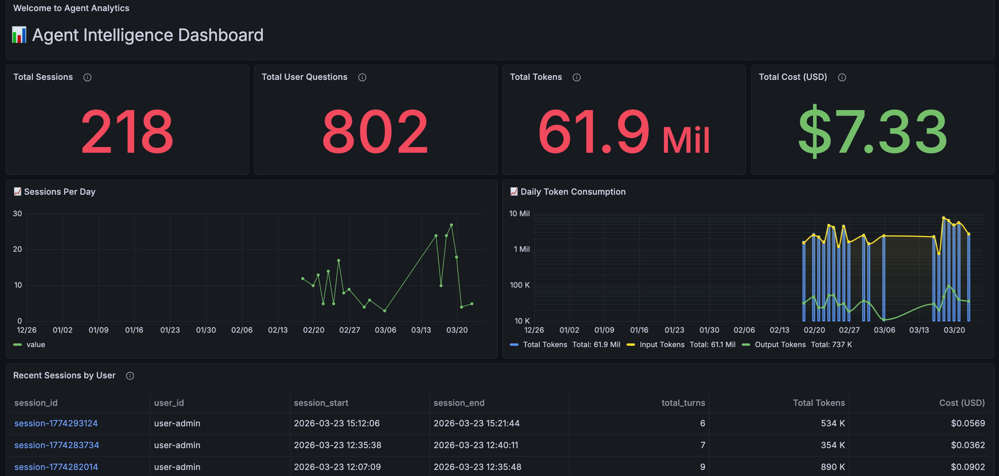
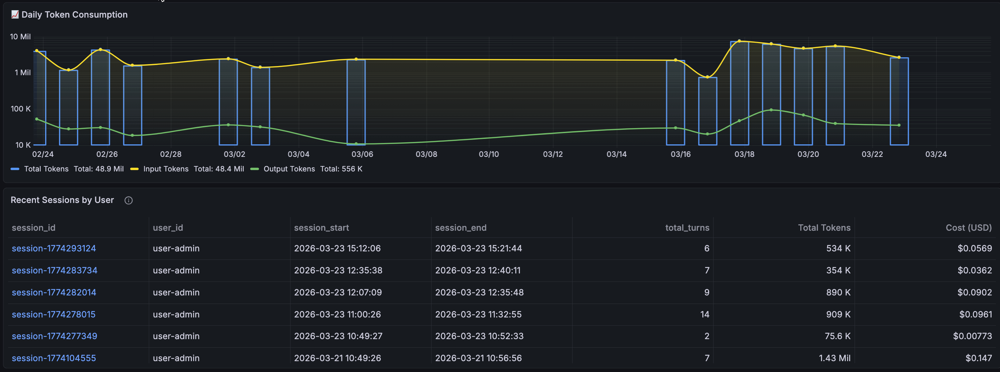
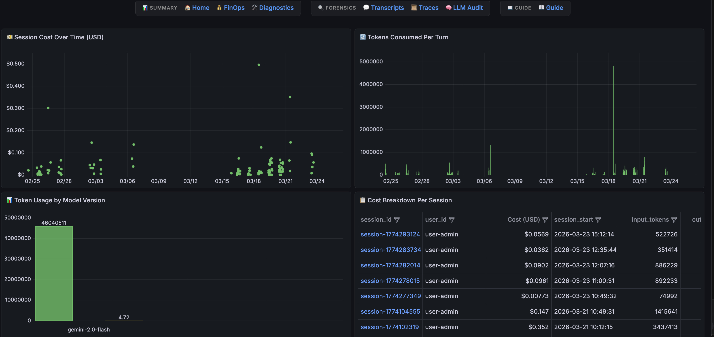
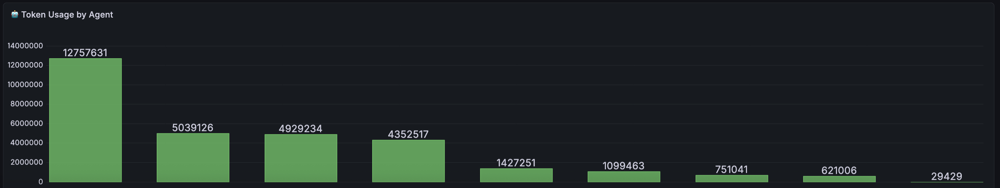
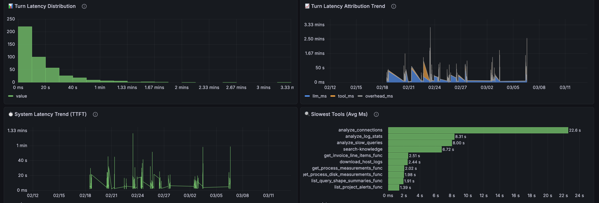
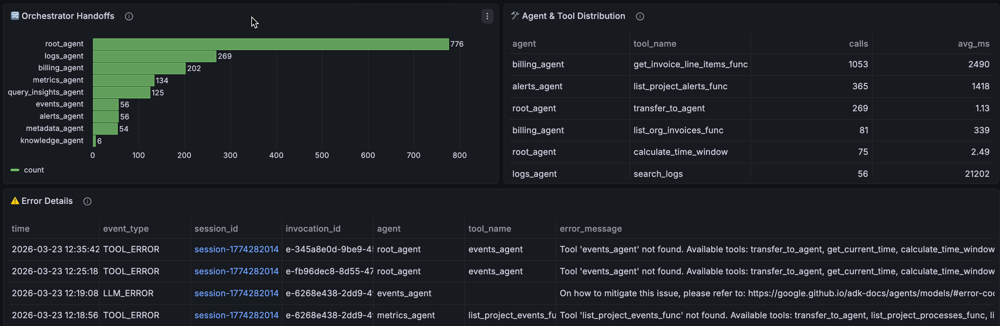
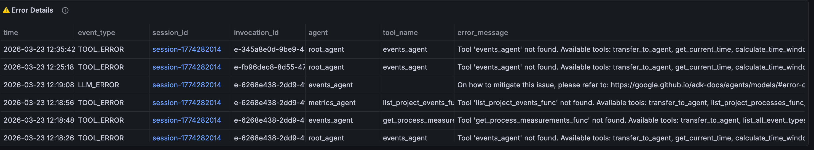
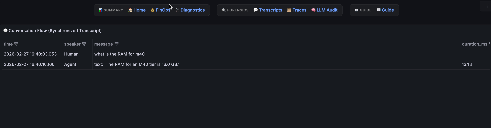
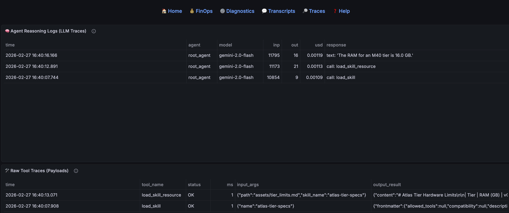
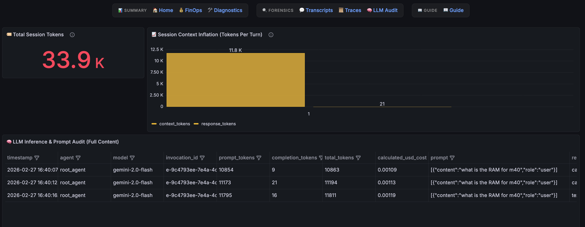

# 📊 Agent Analytics for Google ADK (BigQuery Agent Analytics Plugin)

**Agent Analytics** is a comprehensive **LLM observability suite** designed for conversational agents built with the **Google Agent Development Kit (ADK)**. It transforms raw **BigQuery** agent logs configured from **BigQuery Agent Analytics Plugin** into actionable intelligence, providing powerful **Grafana dashboards** for tracking LLM token costs, system latency, precision metrics, and full-text session transcripts.

> **Keywords**: BigQuery Agent Analytics Plugin, Grafana Dashboards, Google Agent Development Kit, ADK, LLM Observability, Generative AI Metrics, Conversational Agent Monitoring, AI Telemetry.

**Minimum ADK Version:** 1.19.0  
**Tested With:** 1.26.0

> [!IMPORTANT]
> These **8 custom master views** are specific to this observability suite and its data layering strategy. They are distinct from the standard views functionality introduced in ADK version 1.27.0+.

---

## 🚀 Quick Start (2-Command Deployment)

Deploy the entire analytics stack using our automated scripts:

### 1. Setup the BigQuery Data Layer
Creates the **8 custom master analytical views** (flattened JSON, costs, latencies).
```bash
python3 setup_bq_views.py --project <PROJECT_ID> --dataset <DATASET_ID> --table <TABLE_NAME>
```

### 2. Setup the Grafana Visual Layer (Optional)
Configures and imports 7 interconnected dashboards into your target Grafana folder. **Parameters like `--datasource-uid` can be auto-detected if omitted.**
```bash
python3 setup_dashboards.py --project <PROJECT_ID> --dataset <DATASET_ID> --table <TABLE_NAME> --url <GRAFANA_URL>
```
> [!TIP]
> Both scripts are interactive. If you omit any required flags, the script will prompt you for them during execution.

---

## ⚙️ Installation & Managing Grafana (macOS/Homebrew)

### 1. Installation
If you don't have Grafana installed, use Homebrew:
```bash
# 1. Install Grafana
brew install grafana

# 2. Add BigQuery Plugin (Required)
grafana-cli plugins install grafana-google-bigquery-datasource
```

### 2. Service Management
Use these commands to manage the background service:

| Action | Command |
| :--- | :--- |
| **Start** | `brew services start grafana` |
| **Stop** | `brew services stop grafana` |
| **Restart** | `brew services restart grafana` |
| **Status** | `brew services list` |

> [!NOTE]
> Once started, access your local dashboard at [http://localhost:3000](http://localhost:3000).

The Agent Analytics Suite is now 100% production-ready, interactive, and calibrated for forensic recency.

---

---

## 🖼️ Dashboard Gallery

### 🏠 Agent Home (Landing)
Executive overview of fleet performance (Sessions, User Questions, Tokens, Cost).





### 💰 FinOps & 🛠️ Diagnostics
Deep dives into token costs and system latency/errors.








### 💬 Transcripts & 📜 Technical Traces
Turn-by-turn chat logs and trace-level tool payload auditing with **Full Content Expansion (Inspect Mode)**.




### 🧠 LLM & Prompt Audit
Context inflation tracking and raw prompt-response evaluation.



### 📖 Agent Intelligence Guide
A centralized documentation hub for metric glossaries and system architecture usage.

---

## 🏗️ Documentation Structure

| Document | Focus | Contents |
| :--- | :--- | :--- |
| README.md | **Setup** | Fast deployment & manual prep. |
| bq_dashboard_views.md | **Understanding Views** | SQL logic & field mappings. |
| dashboard_spec.md | **Understanding Dashboards** | Business metrics & panel definitions. |
| grafana_architecture_guide.md | **Architecture** | Drill-down logic & navigation. |

---

## 🛠️ Requirements & Manual Setup

### Requirements
- **Google ADK Configured with BigQuery Agent Analytics Plugin**: Follow the [official integration guide](https://google.github.io/adk-docs/integrations/bigquery-agent-analytics/#use-with-agent) to ensure your agent is emitting logs to BigQuery.

       from google.adk.plugins.bigquery_agent_analytics_plugin import ( BigQueryAgentAnalyticsPlugin, BigQueryLoggerConfig)
  
- **Google Cloud SDK** (authenticated)
- **BigQuery** (with ADK logs)
- **Grafana** (with BigQuery Data Source plugin)

### Manual Setup Steps
If you prefer not to use the scripts, follow these steps:
1.  **Service Account**: Create a GCP Service Account with `BigQuery Data Viewer` and `BigQuery Job User` roles. Download the JSON key.
2.  **SQL Views**: Manually execute the queries found in bq_dashboard_views.md.
3.  **Grafana Datasource**: Add the BigQuery datasource in Grafana using your Service Account key.
4.  **Import Dashboard JSONs**: Manually import the `.template.json` files from this directory into Grafana (requires manual search/replace for placeholders).

---

## 👤 Author

Developed and maintained by **Tanuj Bolisetty**.

---

*Empowering Transparent AI - Built for Google ADK Developers.*
