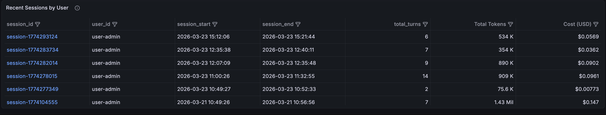
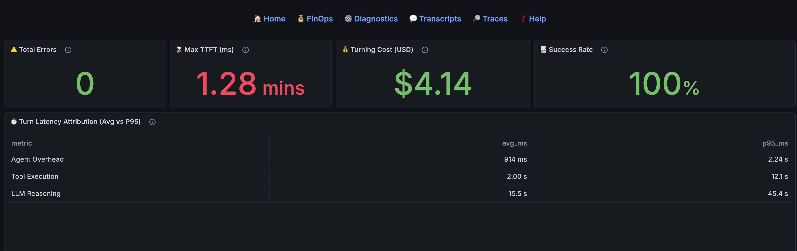
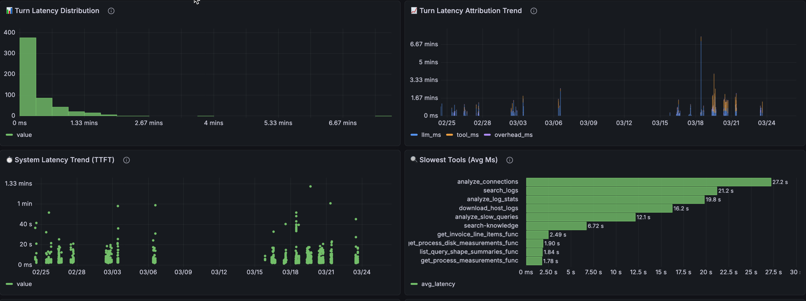

# 📊 Agent Analytics: Multi-Framework LLM Observability (Designed for BigQuery Agent Analytics Plugin data)

**Agent Analytics** is a framework-agnostic **LLM observability suite** designed for modern conversational agents. Whether built with the **Google Agent Development Kit (ADK)**, **LangChain**, or other popular frameworks, it transforms raw **BigQuery** agent logs (configured via the **BigQuery Agent Analytics Plugin**) into actionable intelligence through powerful **Grafana dashboards** for tracking LLM token costs, system latency, precision metrics, and full-text session transcripts.

> **Keywords**: BigQuery Agent Analytics Plugin, Grafana Dashboards, Google Agent Development Kit, ADK, LLM Observability, Generative AI Metrics, Conversational Agent Monitoring, AI Telemetry.

**Minimum ADK Version:** 1.19.0  
**Tested With:** 1.26.0  
**Suite Version:** v1.3

> [!IMPORTANT]
> These **8 custom master views** are specific to this observability suite and its data layering strategy. They are distinct from the standard views functionality introduced in ADK version 1.27.0+.

---

---

## 🛠️ Step 1: Requirements & Local Setup

### System Requirements
- **LLM Logs**: Your agent must be emitting logs to BQ via the BigQuery Agent Analytics Plugin.
  <details>
  <summary><b>🔍 How to emit logs from your agent? (Google ADK)</b></summary>
  <br>

  ```python
  from google.adk.apps import App
  from google.adk.plugins.bigquery_agent_analytics_plugin import BigQueryAgentAnalyticsPlugin

  bq_plugin = BigQueryAgentAnalyticsPlugin(
      project_id=PROJECT_ID,
      dataset_id=DATASET_ID,
      table_id=TABLE_ID,
  )
  app = App(
      name="my_bq_agent",
      root_agent=root_agent,
      plugins=[bq_plugin],  # That's it - automatic logging enabled!
  )
  ```
  </details>
- **Google Cloud SDK**: Must be installed and authenticated.

### Grafana Installation
If you don't have Grafana installed yet, expand the section for your operating system to set it up in seconds. Grafana runs on `http://localhost:3000` by default.

<details>
<summary><b>🍎 macOS (Homebrew)</b></summary>
<br>

```bash
# 1. Install Grafana
brew install grafana

# 2. Add the Google BigQuery Plugin (Required)
grafana-cli plugins install grafana-google-bigquery-datasource

# 3. Start Grafana
brew services start grafana
```
</details>

<details>
<summary><b>🪟 Windows (Winget)</b></summary>
<br>

*Run these commands in an Administrator PowerShell:*
```powershell
# 1. Install Grafana
winget install GrafanaLabs.Grafana

# 2. Add the Google BigQuery Plugin (Required)
cd "C:\Program Files\GrafanaLabs\grafana\bin"
.\grafana-cli.exe plugins install grafana-google-bigquery-datasource

# 3. Start Grafana
Start-Service Grafana
```
</details>

<details>
<summary><b>🐧 Linux (Ubuntu/Debian APT)</b></summary>
<br>

```bash
# 1. Install Grafana
sudo apt-get install -y apt-transport-https software-properties-common wget
wget -q -O - https://packages.grafana.com/gpg.key | sudo apt-key add -
echo "deb https://packages.grafana.com/oss/deb stable main" | sudo tee -a /etc/apt/sources.list.d/grafana.list
sudo apt-get update && sudo apt-get install grafana

# 2. Add the Google BigQuery Plugin (Required)
sudo grafana-cli plugins install grafana-google-bigquery-datasource

# 3. Start Grafana
sudo systemctl enable grafana-server
sudo systemctl start grafana-server
```
</details>

### Authentication Options
The BigQuery plugin requires authentication to query your logs. Depending on where Grafana is deployed, you have three choices:

1. **Local Development (No Keys Needed)**: If running on your laptop, simply run `gcloud auth application-default login` in your terminal. Grafana will securely inherit these credentials via Application Default Credentials (ADC).
2. **Google Cloud Infrastructure (No Keys Needed)**: If Grafana is hosted on a GCE VM, GKE cluster, or Cloud Run, it will automatically use the permissions of the attached Service Account via ADC. Ensure the attached service account has `BigQuery Data Viewer` and `BigQuery Job User` roles.
3. **Service Account JSON Key**: If hosted outside GCP or if you prefer explicit key management, you can create a GCP Service Account with the required roles, download the JSON key, and securely upload it via the Grafana UI.

---

## 🚀 Step 2: Quick Start (Automated Deployment)

Deploy the entire analytics stack using our automated scripts. The scripts are interactive and will prompt you for any missing information!

### 1. Setup the BigQuery Data Layer
Creates the **8 custom master analytical views** (flattened JSON, costs, latencies) directly in your BigQuery project.
```bash
python3 ./setup/setup_bq_views.py --project <PROJECT_ID> --dataset <DATASET_ID> --table <TABLE_NAME>
```

### 2. Setup the Grafana Visual Layer
Configures and imports all **7 interconnected dashboards** into Grafana. 
*✨ Note: If a BigQuery Data Source doesn't exist yet, this script will ask if you want to automatically create one using your Application Default Credentials (ADC)! This seamlessly handles options #1 and #2 above.*
```bash
python3 ./setup/setup_dashboards.py --project <PROJECT_ID> --dataset <DATASET_ID> --table <TABLE_NAME> --url http://localhost:3000
```

---

## ⚙️ Advanced Configuration (Optional)

### Maintaining Model Pricing
The FinOps and LLM Audit dashboards calculate costs based on the `model_pricing` table created in `setup/setup_bq_views.py`. 
To update pricing or add new models:
1.  **Modify SQL**: Update rows in the `pricing_sql` block of [./setup/setup_bq_views.py](./setup/setup_bq_views.py) (lines 10-20).
2.  **Re-Run Setup**: Execute `python3 ./setup/setup_bq_views.py` with your environment parameters.

### Manual Setup Steps
If you prefer not to use the automated python scripts, follow these steps:
1.  **Service Account**: Create a GCP Service Account with `BigQuery Data Viewer` and `BigQuery Job User` roles and download the JSON key.
2.  **SQL Views**: Manually execute the queries found in [./docs/bq_dashboard_views.md](./docs/bq_dashboard_views.md).
3.  **Grafana Datasource**: Add a BigQuery datasource in Grafana Settings -> Connections, and upload your Service Account JSON key.
4.  **Import Dashboard JSONs**: Manually replace all occurrences of `${gcp_project}`, `${bq_dataset}`, `${bq_table}`, and `${datasource}` in the `.template.json` files, then import them manually into Grafana.

---

---

## 🖼️ Dashboard Gallery

### 🏠 Agent Home (Landing)
Executive overview of fleet performance (Sessions, User Questions, Tokens, Cost).
- **NEW (v1.3)**: Integrated **User Intent** (What people are asking) directly onto the homepage with a full-width, zero-scroll layout.
- **NEW (v1.3)**: Global **Column Filtering** enabled across all major tables.





### 💰 FinOps & 🛠️ Diagnostics
Deep dives into token costs and system latency/errors.







### 💬 Transcripts & 📜 Technical Traces
Turn-by-turn chat logs and trace-level tool payload auditing with **Full Content Expansion (Inspect Mode)**.


### 🧠 LLM & Prompt Audit
Context inflation tracking and raw prompt-response evaluation.


### 📖 Agent Intelligence Guide
A centralized documentation hub for metric glossaries and system architecture usage.

---

## 🏗️ Documentation Structure

| Document | Focus | Version | Contents |
| :--- | :--- | :--- | :--- |
| README.md | **Setup** | v1.3 | Fast deployment & manual prep. |
| bq_dashboard_views.md | **Understanding Views** | v1.3 | [SQL logic & field mappings](./docs/bq_dashboard_views.md). |
| dashboard_spec.md | **Understanding Dashboards** | v1.3 | [Business metrics & panel definitions](./docs/dashboard_spec.md). |
| grafana_architecture_guide.md | **Architecture** | v1.3 | [Drill-down logic & navigation](./docs/grafana_architecture_guide.md). |

## 📚 References
- [Building Observable AI Agents: Real-time Analytics for LangGraph with BigQuery Agent Analytics](https://medium.com/google-cloud/building-observable-ai-agents-real-time-analytics-for-langgraph-with-bigquery-agent-analytics-9a1ac20837ec)

---

## 👤 Author

Developed and maintained by **Tanuj Bolisetty**.

---

*Empowering Transparent AI - Built for Modern AI Developers.*
