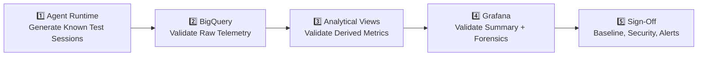
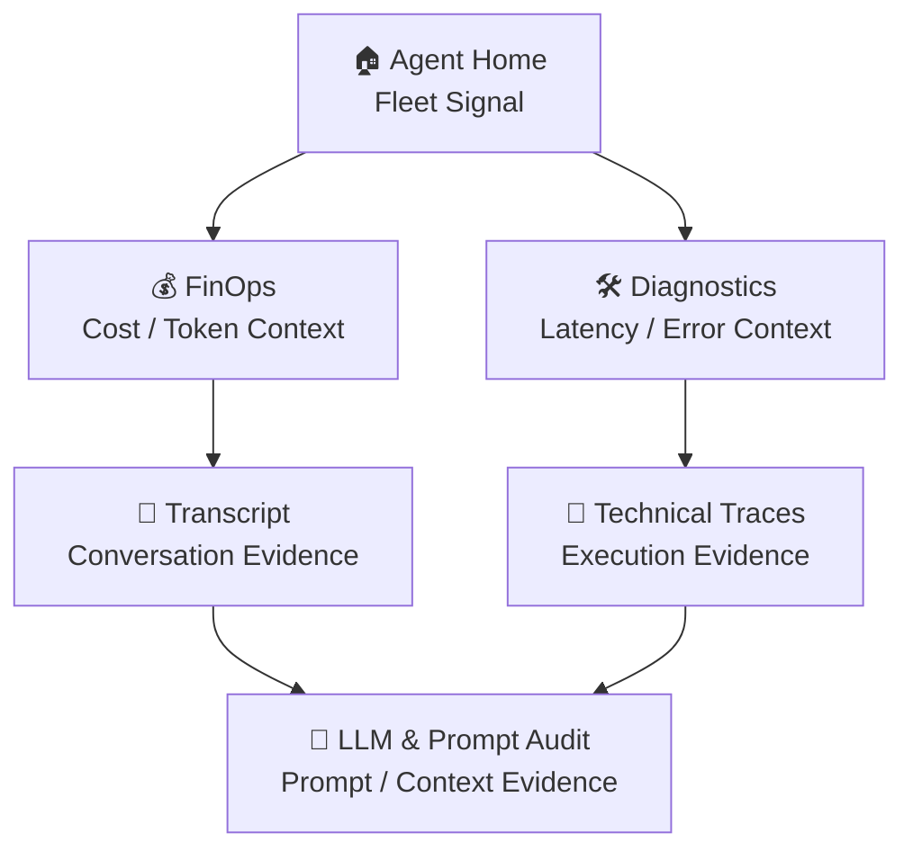

# 🛡️ Production Readiness Guide: Validation & Operational Guardrails

This document defines the **production-readiness validation standards** for the Agent Analytics Suite.

The objective is to ensure that the complete observability path—from **Agent Runtime** to **BigQuery Agent Analytics**, analytical views, and **Grafana dashboards**—is accurate, secure, and operationally trustworthy before the suite is used for production troubleshooting, FinOps review, or forensic analysis.

---

## 🧭 Design Philosophy: "Trust Before Visibility"

To complement the suite's **Forensic Symmetricity** model, production readiness follows a simple principle:

> **Do not treat a dashboard as an operational source of truth until the telemetry, analytical layer, navigation context, and access controls behind it have been validated.**

### 1. Dual-Readiness Patterns

- **Summary Readiness** (Home, FinOps, Diagnostics):
  - **Default State**: Fleet-level validation across users, sessions, models, and time ranges.
  - **Goal**: Confirm KPI completeness, cost/latency consistency, and environment correctness before broad operational use.

- **Forensic Readiness** (Transcripts, Traces, LLM Audit):
  - **Default State**: Explicit User/Session selection.
  - **Goal**: Confirm that a single production interaction can be traced from high-level symptoms to raw conversation, tool, and LLM evidence.

### 2. Standardized Production Rules

- **Infrastructure Visibility**: Verify `gcp_project`, `bq_dataset`, `bq_table`, and `datasource` before interpreting dashboard results.
- **Telemetry Completeness**: A session should be visible across the expected BigQuery views before forensic dashboards are considered reliable.
- **Recency-First Validation**: Recent test users/sessions should appear first where the suite applies recency-first sorting.
- **Context Preservation**: User, Session, Time Range, Datasource, Project, Dataset, and Table context must remain consistent across Data Links.
- **Wide Open Display**: Transcript and technical payload content must remain inspectable without unexpected truncation.
- **Least Privilege**: Summary and forensic data access should be granted according to operational need.

---

## The 5-Tier Production Readiness Flow

The validation flow follows the same high-level-to-low-level philosophy used by the dashboard application.

### 1. Agent Runtime — Controlled Input

**Goal**: Generate known interactions that can be traced through the complete observability stack.

- Run a normal successful conversation.
- Run a longer multi-turn/high-context conversation.
- Trigger a controlled tool or backend failure.
- Run a multi-agent or routing flow when supported.

### 2. BigQuery Telemetry — Source Verification

**Goal**: Confirm that the expected Agent Analytics records exist before validating dashboards.

- Verify new sessions appear in the configured BigQuery table.
- Confirm timestamp, session, invocation, agent, and model identifiers are populated as expected.
- Validate token and latency-related fields used by the analytical views.
- Review representative transcript and trace payloads for completeness.
- Check that controlled failures produce diagnostic evidence.

### 3. Analytical Views — Metric Integrity

**Goal**: Confirm that the suite's custom analytical views produce consistent dashboard-ready data.

- Verify all expected custom master views were created successfully.
- Confirm recent sessions are returned by the relevant views.
- Check for unexpected nulls in cost, token, latency, transcript, routing, or trace fields.
- Validate that session-level totals reconcile with turn-level and LLM-call details.
- Review model-pricing assumptions before using cost metrics for FinOps reporting.
- Confirm queries perform within an acceptable interactive range.

### 4. Grafana — Summary & Forensic Validation

**Goal**: Validate that dashboards preserve context while moving from fleet signals to session evidence.

- **Agent Home**: Validate sessions, user questions, token volume, and estimated cost.
- **FinOps**: Validate cost trends, token usage, and model/agent attribution.
- **Diagnostics**: Validate latency attribution, errors, and routing/handoff visibility.
- **Transcripts**: Validate complete conversation flow and message readability.
- **Technical Traces**: Validate tool payloads, chronology, and session performance details.
- **LLM & Prompt Audit**: Validate prompt/response content and context inflation behavior.
- **Agent Intelligence Guide**: Validate metric definitions used during operational review.

### 5. Production Sign-Off — Operational Trust

**Goal**: Establish that the suite is safe to use for recurring production review.

A production sign-off should confirm:

- Telemetry completeness.
- Analytical-view consistency.
- Dashboard context preservation.
- Cost/pricing review.
- Access-control review.
- Sensitive transcript/trace review.
- Baseline latency, token, cost, and failure behavior.
- Alert candidates based on observed baseline behavior.

---

## ⚙️ Controlled Validation Scenarios

Use known test sessions to verify expected behavior before relying on production traffic.

| Scenario | Validation Focus | Expected Result |
| :--- | :--- | :--- |
| **Normal Agent Session** | End-to-end visibility | Session, tokens, latency, transcript, and LLM details are available |
| **High-Context Session** | Token/cost/context growth | FinOps and LLM Audit reflect increased context and model usage |
| **Tool or Backend Failure** | Diagnostics & traces | Failure is visible with enough execution context for troubleshooting |
| **Multi-Agent / Routing Flow** | Handoffs & chronology | Agent routing and execution order can be followed across views |

### Forensic Validation Standard

A single controlled session should be traceable through the following path:

**Goal**: The operator should be able to move from **"What looks wrong?"** to **"What exactly happened?"** without losing the selected environment, user, session, or time context.

---

## 🔐 Reliability, Security & Governance Standards

Production observability is not only a visualization concern. Agent telemetry can contain both **business intent** and **execution detail**.

### 1. Data Quality

- **Completeness**: Expected sessions, turns, LLM calls, and traces are present.
- **Freshness**: Data appears within the expected ingestion/query delay.
- **Consistency**: Session-level KPIs align with detailed turn-level records.
- **Cost Accuracy**: Model-pricing assumptions are reviewed when models change.
- **Schema Stability**: Optional or missing fields do not silently invalidate critical panels.

### 2. Access & Security

- **BigQuery Access**: Apply least-privilege dataset permissions.
- **Grafana Access**: Restrict forensic dashboards based on operational role.
- **Credential Hygiene**: Prefer managed/ADC-style authentication where appropriate instead of unmanaged long-lived keys.
- **Transcript Sensitivity**: Treat user prompts and agent responses as potentially sensitive.
- **Trace Sensitivity**: Review tool payloads for credentials, secrets, internal identifiers, or regulated data.
- **Retention**: Define an appropriate retention period for conversation and trace data.

### 3. Operational Failure Checks

Before sign-off, validate how the observability layer behaves when:

- Telemetry stops arriving.
- A BigQuery view/query fails.
- A dashboard variable resolves to an incorrect environment.
- A session contains incomplete or malformed records.
- A tool/backend error occurs.
- Pricing or model names change.

---

## 🚨 Baseline & Alerting Standards

Alerts should be added **after** normal behavior has been established.

### Candidate Alert Signals

- Sudden increase in failed interactions.
- Abnormal increase in p95/max latency.
- Unexpected token or estimated-cost spike.
- Missing telemetry for an active production agent.
- BigQuery analytical-view/query failures.
- Dashboard data-freshness delay.
- Repeated tool/backend failures.
- Rapid context growth across turns.

### Alerting Rules

- **Baseline First**: Do not copy thresholds from another environment without validation.
- **Signal Over Noise**: Separate informational signals from action-required alerts.
- **Ownership**: Route alerts to the appropriate Platform, Agent Engineering, FinOps, or Security owner.
- **Revalidation**: Review thresholds after major model, agent, tool, schema, or traffic changes.

---

## ✅ Production Sign-Off Matrix

| Area | Readiness Requirement | Status |
| :--- | :--- | :---: |
| **BigQuery Telemetry** | Controlled sessions are captured completely | ⬜ |
| **Analytical Views** | Expected views return recent and consistent records | ⬜ |
| **Infrastructure Context** | Project, dataset, table, and datasource are verified | ⬜ |
| **Summary Dashboards** | Fleet-level KPIs are consistent with source data | ⬜ |
| **Forensic Dashboards** | Transcript, trace, and LLM audit views are usable | ⬜ |
| **Navigation State** | Data Links preserve selected context | ⬜ |
| **Cost Validation** | Pricing assumptions have been reviewed | ⬜ |
| **Security Review** | Transcript and trace exposure has been reviewed | ⬜ |
| **Access Control** | BigQuery/Grafana access follows least privilege | ⬜ |
| **Baseline** | Normal latency, token, cost, and failure behavior is known | ⬜ |
| **Alerting** | Alert candidates are defined from observed behavior | ⬜ |

---

## Related Documentation

- **[dashboard_spec.md](dashboard_spec.md)** — Business metrics, dashboard panel definitions, and Forensic Symmetricity.
- **[bq_dashboard_views.md](bq_dashboard_views.md)** — BigQuery analytical-view logic and field mappings.
- **[grafana_architecture_guide.md](grafana_architecture_guide.md)** — Navigation, variable propagation, Data Links, and drill-down behavior.

---

*Empowering Transparent AI - Production-ready observability for Agentic Workflows.*
